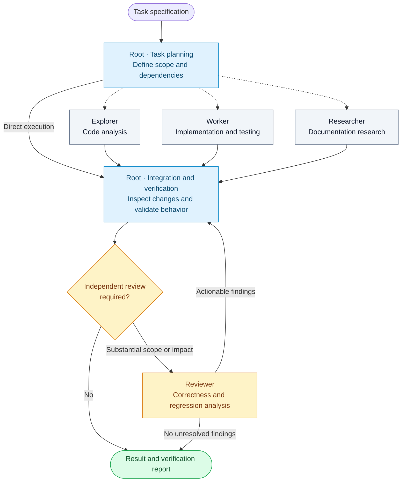

# Codex Agent Tree

An orchestration skill for coding agents, maintained by **RSB-HOLDING**.

Codex Agent Tree defines a workflow in which a root agent coordinates specialized agents for code exploration, implementation, documentation research, and independent review. The root retains responsibility for task scope, integration, and verification.

The repository contains the skill specification, Codex interface metadata, and evaluation scenarios. Execution is provided by the host's agent runtime.

## Architecture

The root determines which subtasks can be delegated and which require sequential execution. Each delegated assignment has a defined objective, ownership boundary, and expected evidence. Results return to the root for integration and validation.



Dashed edges indicate optional delegation. Independent assignments may execute concurrently. Assignments with dependencies begin after the required findings are available. The same root agent performs planning and integration; the diagram does not imply a fixed number of agents.

### Model configuration

| Role | Responsibility | Preferred model | Reasoning effort |
| --- | --- | --- | --- |
| Root | Planning, coordination, integration, verification | GPT-6.1 Sol | High |
| Explorer | Code inspection and execution-path analysis | GPT-6.1 Sol | Medium |
| Worker | Implementation and targeted validation | GPT-6.1 Sol | Medium |
| Researcher | Investigation using authoritative documentation | GPT-6.1 Sol | Medium |
| Reviewer | Independent assessment of substantial or consequential changes | GPT-6 Astra | Extra high (`xhigh`) |

This profile expresses the project's model preferences. Availability depends on the host and account. Explicit user choices take precedence, and substitutions must be disclosed. The root model is selected in the client; the skill does not change a running session's model or global configuration.

## Execution policy

- **Task allocation:** Delegate bounded work when independent execution or specialist analysis contributes to the task. Complete small or tightly coupled changes in the root.
- **Write ownership:** Assign one writer to each shared file or resource. Serialize overlapping changes or use isolated worktrees when supported by the project.
- **Integration:** Inspect the combined changes and run the checks required to establish the requested behavior. Agent reports remain distinct from verified results.
- **Review:** Request independent assessment when scope or consequences warrant it. Resolve actionable findings before reporting completion.
- **Authorization:** Delegated agents inherit the parent's scope and permissions. Publication and deployment require authorization under the original task.

## Installation

Install through Codex's skill installer:

```text
Install the skill from https://github.com/RSB-HOLDING/codex-agent-tree/tree/main/skills/codex-agent-tree
```

Or clone the repository and copy `skills/codex-agent-tree` into a skill directory supported by your Codex installation. For installations using `~/.codex/skills`, the following commands preserve any existing installation:

```sh
git clone https://github.com/RSB-HOLDING/codex-agent-tree.git && (
mkdir -p "${CODEX_HOME:-$HOME/.codex}/skills"
skill_destination="${CODEX_HOME:-$HOME/.codex}/skills/codex-agent-tree"
if [ -e "$skill_destination" ]; then
  echo "Skill already exists; review it before updating."
else
  cp -R codex-agent-tree/skills/codex-agent-tree "$skill_destination"
fi
)
```

Start a new chat or refresh skills as supported by your client. Installation copies instructions and UI metadata; it does not install an agent runtime or change model configuration. Automatic discovery uses the skill description; you can also invoke it explicitly.

## Usage

```text
Use $codex-agent-tree to investigate intermittent session refresh failures,
implement a correction, and verify the affected behavior.
```

```text
Use $codex-agent-tree to implement pagination. Establish the API contract
before assigning implementation, then validate the integrated change.
```

Delegation adapts to the task. A localized correction may require only the root. A framework migration may involve code exploration, documentation research, implementation, and independent review, ordered by their dependencies.

## Evaluation and limitations

The [evaluation protocol](docs/evaluation.md) specifies scenarios for dependency handling, concurrent edits, model availability, authorization, and verification. These are acceptance criteria for evaluation; the repository does not report benchmark results or measured performance improvements.

The package depends on the host's models, tools, permissions, and project instructions. When delegation is unavailable, the root can perform the roles sequentially and report that limitation. Sequential execution does not satisfy a requirement for independent review.

## Repository structure

| File | Purpose |
| --- | --- |
| [SKILL.md](skills/codex-agent-tree/SKILL.md) | Agent roles, allocation policy, assignment scope, and verification requirements |
| [agents/openai.yaml](skills/codex-agent-tree/agents/openai.yaml) | Codex display metadata and invocation prompt |
| [docs/evaluation.md](docs/evaluation.md) | Evaluation conditions and observable acceptance criteria |
| [LICENSE](LICENSE) | MIT license |

## Contributions

Submit an issue or pull request with the observed failure, relevant execution context, and proposed change. Instruction changes should include a scenario that demonstrates their effect on agent decisions. Validate the skill structure and evaluate the affected behavior using the [evaluation protocol](docs/evaluation.md).

## Provenance and references

The workflow was developed from an agent-role diagram supplied to the project. The original image is not included. RSB-HOLDING maintains this repository as an independent open-source project.

The package uses the directory structure described in [OpenAI's skills documentation](https://developers.openai.com/api/docs/guides/tools-skills). Host-specific orchestration controls are documented in [OpenAI's subagent documentation](https://learn.chatgpt.com/docs/agent-configuration/subagents). The model profile in this repository is a project preference.

Released under the [MIT license](LICENSE).
