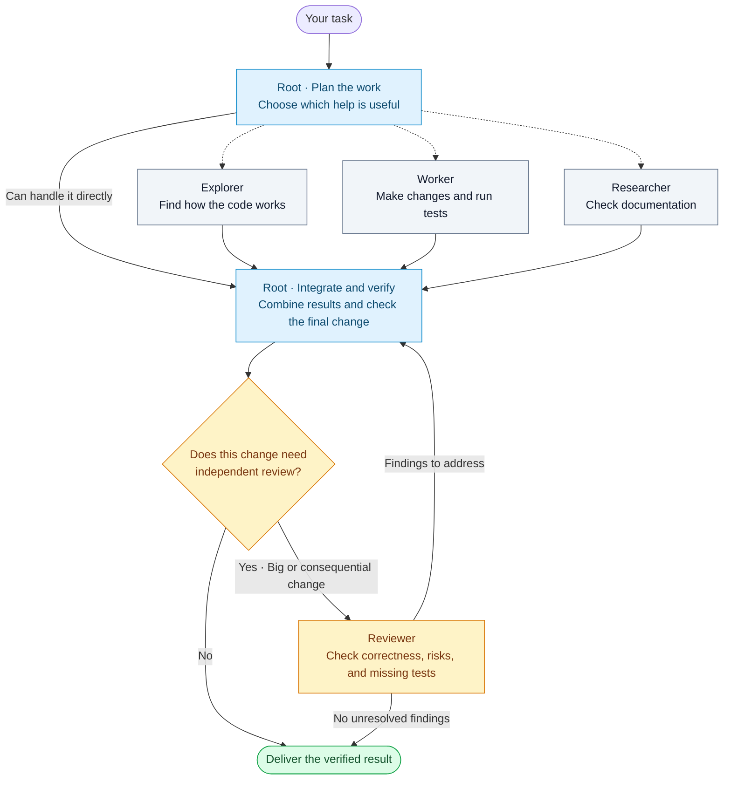

# Codex Agent Tree

**Split useful work. Don't spawn every role.**

A small, portable Codex skill for selective delegation with one accountable integrator. The root chooses which branches help, combines their work, and verifies the result.

## How the team works

The **root agent leads the task from start to finish**. It delegates only the work that benefits from another agent, then brings the results together and checks them.



**How to read it:** Dashed arrows mean optional delegation. Use zero, one, or several helpers. Independent tasks can run in parallel; tasks that need another agent's findings wait for them. The root remains responsible for the final result.

### Preferred models

| Role | What it does | Model | Reasoning |
| --- | --- | --- | --- |
| **Root** | Plans, coordinates, integrates, and verifies | GPT-6.1 Sol | High |
| **Explorer** | Reads and traces code | GPT-6.1 Sol | Medium |
| **Worker** | Edits code and runs tests | GPT-6.1 Sol | Medium |
| **Researcher** | Looks up authoritative documentation | GPT-6.1 Sol | Medium |
| **Reviewer** | Independently reviews big or consequential changes | GPT-6 Astra | Extra high (`xhigh`) |

These are preferred settings, not a claim that every account or host provides these models. The skill respects explicit model choices, checks host capabilities, and discloses fallbacks. It cannot switch the root model or enable missing delegation tools. Choose the preferred root model in your client if you want the pictured profile.

## Install

Ask Codex's skill installer:

```text
Install the skill from https://github.com/RSB-HOLDING/codex-agent-tree/tree/main/skills/codex-agent-tree
```

Or clone the repository and copy `skills/codex-agent-tree` into a skill directory supported by your Codex installation. For installations using `~/.codex/skills`, this shell example refuses to overwrite an existing copy:

```sh
git clone https://github.com/RSB-HOLDING/codex-agent-tree.git && (
mkdir -p "${CODEX_HOME:-$HOME/.codex}/skills"
skill_destination="${CODEX_HOME:-$HOME/.codex}/skills/codex-agent-tree"
if [ -e "$skill_destination" ]; then
  echo "Skill already exists; review it before updating."
else
  cp -R codex-agent-tree/skills/codex-agent-tree "$skill_destination"
fi
)
```

Start a new chat or refresh skills as supported by your client. Installation copies instructions and UI metadata; it does not install an agent runtime or change model configuration. Automatic discovery uses the skill description; you can also invoke it explicitly.

## Use

```text
Use $codex-agent-tree to investigate and fix our flaky session refresh tests.
```

```text
Use $codex-agent-tree to add pagination. Have an explorer trace the API,
and delegate implementation only after its contract is understood.
```

A one-line correction can stay with the root. A framework migration may justify an explorer, documentation researcher, worker, and independent reviewer, with dependent stages ordered. The number of agents follows the work and available capacity.

## What is included

- [SKILL.md](skills/codex-agent-tree/SKILL.md): role selection, model profile, ownership, handoffs, and verification.
- [Codex metadata](skills/codex-agent-tree/agents/openai.yaml): display name and starter prompt.
- [Behavioral evaluation cases](docs/evaluation.md): scenarios maintainers can use to assess changes.
- [MIT license](LICENSE): permission to use, modify, and redistribute this package.

This is an instruction package, not executable orchestration software. Actual behavior depends on the host, model, tools, permissions, and project instructions. The package does not grant permission to publish or deploy the work it coordinates.

## Contributing

Open an issue or pull request with a concrete failure or improvement. Keep the skill small, preserve user choices, and include a realistic example of how the change improves a decision. Validate YAML/frontmatter and run the relevant scenarios in [the evaluation guide](docs/evaluation.md). Do not add mandatory agents or process steps solely to mirror the diagram.

## Background and references

Adapted from a user-provided agent-tree diagram into original skill instructions. The source image is not distributed in this package. Maintained by RSB-HOLDING; this is an independent community project.

The directory format follows [OpenAI's skills documentation](https://developers.openai.com/api/docs/guides/tools-skills). Host-specific agent controls and supported overrides are described in [OpenAI's subagent documentation](https://learn.chatgpt.com/docs/agent-configuration/subagents). The role/model profile above is this project's preferred workflow, not an OpenAI requirement.
